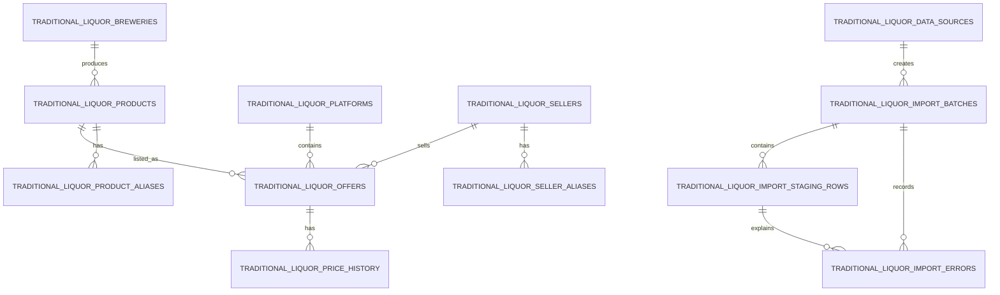

# WooHyukmon Traditional Liquor Market Database

## Purpose

This PostgreSQL schema stores structured market facts: products, breweries, platforms, sellers, offers, prices, sales conditions, and import provenance. It does not store documents, chunks, embeddings, or generated knowledge.

The existing WooHyukmon Knowledge System answers questions about history, manufacturing, culture, research, and uploaded source material. The Market Database answers where a product is listed, by whom, under which conditions, and at what observed price. The two systems may later be combined at the AI orchestration layer, but they do not share tables.

## Technology

- Database: Supabase PostgreSQL
- Application access: server-only Supabase REST client using `SUPABASE_URL` and `SUPABASE_SERVICE_ROLE_KEY`
- ORM: none
- Migration convention: idempotent SQL files under `supabase/`
- Public access: disabled with RLS and explicit grants only to `service_role`

## ER Diagram



## Tables

| Table | Responsibility |
| --- | --- |
| `traditional_liquor_breweries` | Brewery master and regional identity |
| `traditional_liquor_products` | SKU-level product master with a canonical product-family name |
| `traditional_liquor_platforms` | Sales platform master with a unique stable code |
| `traditional_liquor_sellers` | Seller master independent of any platform |
| `traditional_liquor_offers` | Product-platform-seller listing, price, quantity, delivery, stock and provenance |
| `traditional_liquor_price_history` | Time-series observations for each offer |
| `traditional_liquor_product_aliases` | Platform/seller product-name variations |
| `traditional_liquor_seller_aliases` | Platform-specific seller-name variations |
| `traditional_liquor_data_sources` | Manual, file, API, official-data or collector provenance |
| `traditional_liquor_import_batches` | One ingestion run and its row counters |
| `traditional_liquor_import_staging_rows` | Parsed rows awaiting validation and entity resolution |
| `traditional_liquor_import_errors` | Row- and field-level import failures |

## Read Paths

The `v_traditional_liquor_market` security-invoker view joins active Product, Brewery, Offer, Platform and Seller records.

- Product view: filter `product_name`, `canonical_name`, aliases or `product_id`, then group Offer by Platform and Seller.
- Platform view: filter `platform_code` or `platform_id`, then group Offer by Product and Seller.
- Seller view: filter seller name, aliases or `seller_id`, then group Offer by Product and Platform.
- Brewery lookup: search the Brewery master, then load Products through `brewery_id`.
- Price history: query `traditional_liquor_price_history` by `offer_id`, ordered by `observed_at`.

## Deduplication

Product identity is not reduced to one `UNIQUE(name)` rule. Resolution uses normalized names, canonical names, SKU attributes, aliases, and later a dedicated resolution service. Seller resolution follows the same principle.

Offer identity uses two partial unique indexes:

1. `(platform_id, external_offer_id)` when an external ID exists.
2. `(platform_id, listing_url)` when the external ID is absent and a URL exists.

`listing_title` is never treated as a stable unique identifier.

## Import Flow

Planned ingestion flow:

`File/API/Collector -> Import Batch -> Staging Rows -> Validation -> Preview -> Commit -> Offer/Price History`

Raw and normalized payloads remain in staging for auditing. Invalid rows are recorded in `import_errors` rather than inserted into production masters.

## Files and Execution

1. Run `supabase/traditional_liquor_market.sql` once in the Supabase SQL Editor.
2. Optionally run `supabase/traditional_liquor_market_seed.sql` in development only.
3. Verify the view and the five sample query directions described below.
4. `supabase/traditional_liquor_market_rollback.sql` is destructive and is only for an intentional development reset.

The seed uses deterministic UUIDs, `TEST` prefixes, and `example.invalid` URLs so it cannot be mistaken for live market data.

## Repository Boundary

- `MockTraditionalLiquorRepository`: currently drives the browser UI.
- `PostgreSQLTraditionalLiquorRepository`: server-only Supabase implementation for the real schema.
- `TraditionalLiquorRepository`: stable contract shared by both adapters.
- `TraditionalLiquorDataService`: prepares the three UI result directions.

When real data is approved, expose the PostgreSQL repository through a developer-authorized server route and replace the UI's Mock Adapter with an API Adapter. Never import the service-role repository into client code.

## Validation Queries

```sql
-- Product + brewery + offers
select * from public.v_traditional_liquor_market
where product_name ilike '%안동소주%'
order by price;

-- Platform market
select * from public.v_traditional_liquor_market
where platform_code = 'TEST_NAVER'
order by product_name, price;

-- Seller market
select * from public.v_traditional_liquor_market
where seller_name ilike '%판매업체 A%'
order by product_name, platform_name, price;

-- Brewery and its products
select brewery.id, brewery.name, product.id, product.name
from public.traditional_liquor_breweries brewery
left join public.traditional_liquor_products product on product.brewery_id = brewery.id
where brewery.name ilike '%안동%';

-- Price history
select * from public.traditional_liquor_price_history
where offer_id = '70000000-0000-4000-8000-000000000001'
order by observed_at;
```

## Future Connections

- Implement an authenticated `/api/v4/traditional-liquor` read endpoint.
- Add an API Adapter for the client-side UI.
- Build CSV/XLSX parsing, staging preview and explicit commit workflows.
- Add product/seller normalization and deterministic resolution rules.
- Add approved collectors or official APIs as isolated ingestion adapters.
- Add scheduled observations only after source policy and rate limits are defined.
- Combine Market queries with Knowledge retrieval only in the AI tool/orchestration layer.

